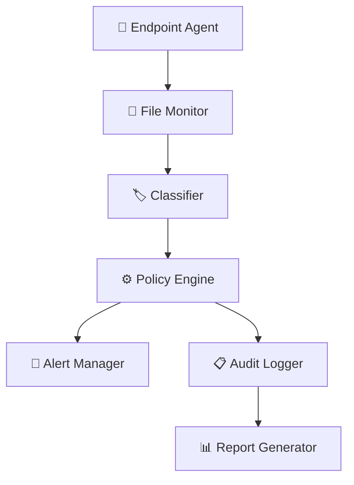

<div align="center">
  
</div>

<div align="center">

# 📦 DataFort  
### Enterprise Data Loss Prevention (DLP) & Insider Risk Monitoring Platform

[](https://www.python.org/)
[]()
[](LICENSE)
[]()
[]()

</div>

---

<div align="center">

### 🚀 Lightweight, Explainable DLP for Enterprise Security Teams  
**Real-time endpoint monitoring • Rule-based classification • Policy alerting • Compliance-ready logging**


</div>

---

## 🎯 Problem Statement

Organizations face **data exposure risks** from:

- 👥 Insider mistakes or misuse  
- 🔍 Unmonitored file access  
- 📋 Weak audit trails  
- ⚠️ Reactive security posture  

### ✅ DataFort Solution

- Continuous file visibility  
- Automated sensitive data classification  
- Real-time policy enforcement  
- Audit-ready logging  

---

## ✨ Core Capabilities

| Capability                     | Status         | Technology        |
|------------------------------|---------------|------------------|
| 📂 File Activity Monitoring   | ✅ Complete    | Watchdog         |
| 🏷️ Data Classification       | 🔄 Active      | Regex Rules      |
| 🚨 Policy Enforcement         | 🔄 Active      | JSON Policies    |
| 📊 Audit Logging              | ✅ Complete    | Structured JSON  |
| 📈 Reporting Dashboard        | ⏳ Planned     | Log Analytics    |

---

## 🏗️ Architecture Overview



##  🛠️ Technical Stack
```
Language: Python 3.11+
File Monitoring: Watchdog
Classification: Regex + Custom Rules
Logging: Structured JSON
Configuration: JSON Policy Files
Testing: pytest
Linting: black, flake8
Deployment: Endpoint Agent
```
## INSTALLATION 

```
git clone https://github.com/yourusername/datafort.git
cd datafort
pip install -r requirements.txt
```
```
# Copy default config
cp config/policies.json.example config/policies.json

# Start monitoring
python main.py

# View logs
tail -f logs/datafort.log
```
## 📁 PROJECT STRUCTURE 
```
DataFort/
├── agent/
│   ├── file_monitor.py
│   ├── classifier.py
│   ├── policy_engine.py
│   └── access_tracker.py
├── alerts/
├── reports/
├── config/
│   ├── policies.json
│   └── regex_rules.json
├── logs/
├── tests/
├── docs/
├── main.py
├── requirements.txt
└── README.md
```

## 📈 Operational Flow
``` 
sequenceDiagram
    participant E as Endpoint
    participant A as Agent
    participant C as Classifier
    participant P as Policy Engine
    participant L as Logger

    E->>A: File Event
    A->>C: Classify
    C-->>A: Risk Score
    A->>P: Evaluate Policy
    P-->>A: Violation?

    alt Violation
        A->>L: Log Incident
    end

    A->>L: Audit Log

```
## 📜 Compliance Alignment
```
✅ ISO 27001
✅ SOC 2
✅ GDPR
✅ HIPAA
```
## 🧪 Development Workflow
```
pip install -r requirements-dev.txt

pytest tests/ --cov=agent

black .
flake8 .
pre-commit run --all-files

mkdocs serve
```
## 🏢 Skills Demonstrated
```
🔐 Security Engineering
🐍 Python Development
📊 Data Classification
⚙️ Policy Engine Design
📈 Compliance Engineering
🏭 Endpoint Security
🔬 SOC Tooling
```

## 📞 Connect

<div align="center">

[](https://www.linkedin.com/in/antarlina-balmiki-3926b6283/))
[](https://twitter.com/yourhandle)
[](mailto:your.email@example.com)

</div>

---

## ⚖️ License

This project is licensed under the **MIT License** — see the `LICENSE` file for details.

---

<div align="center">

⭐ **If you found this useful, consider giving it a star!**  
🍴 **Fork it and contribute**  
🐛 **Found a bug? Open an issue**

<br/>

**#DLP #CyberSecurity #Python #SecurityEngineering**

<br/>

🛡️ **Built for Enterprise Security Teams**  
🔒 **Protecting Your Most Valuable Asset: Data**

</div>
